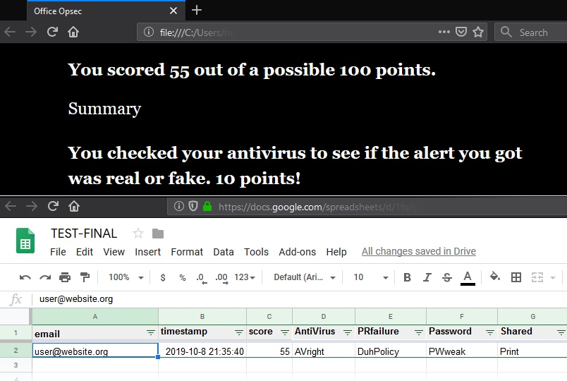

# twine-sheets-app
## Write to a Google Sheets document from a Twine app

### Goal

* Enable a Twine story (an HTML document) to update a Google Sheets document when the user completes the interactive story. 

### Configuration Summary

* Steps 1-12: Create a Google Sheets doc in the Google Drive of a GCP-connected user, load and initialize a web app script, deploy the Sheets doc as a web app.
* Steps 13-23: Configure a GCP service account to facilitate the necessary compute services.
* Steps 24-27: Share the Sheets doc with the e-mail address associated with the service account.
* Steps 28-35: Edit the Twine app, inserting the new Sheets web app URL.

### Notes

* Requests posted to the Sheets web app trigger a compute usage.
* The request originates from the user's browser, and malicious requests to the sheet may be possible. Any hardening should probably begin in Code.gs.

### Configuration

1. In the Google Drive of a GCP-connected account, create a new Sheets doc.
2. **In the Sheets doc**, choose File -> Import, Upload. Upload the provided "Office OpSec.xlsx." Choose "Replace spreadsheet." Click "Import data."
3. Go to Tools -> Script editor.
4. Over the contents of new Code.gs, paste code from provided Code.gs.
5. CTRL+S to save. Enter an arbitrary project name. Click OK.
6. Run -> Run function -> setup
7. At "Authorization required," click "Review Permissions."
8. Choose the user account that owns the Sheets doc.
9. Click Allow.
10. Publish -> Deploy as web app...
11. Project version: New, Execute as: Me, Who has access: "Anyone, even anonymous." Click Deploy.
12. Copy the Current web app URL, ending in /exec, to be inserted in the Twine app custom JavaScript in step 33.
13. **In the GCP console** (https://console.cloud.google.com/), in the Projects dropdown, choose "New Project."
14. Name the project. Click Create.
15. Return to the dashboard. Make sure the new project is selected as the current project. Go to APIs & Services -> Credentials.
16. In the "Create Credentials" dropdown, choose "Service Account Key."
17. In the "Service Account" dropdown, choose "New Service Account."
18. Name the service account. Write down the service account ID e-mail address (e.g. account-name@project-name.iam.gserviceaccount.com), to be used in step 25 when sharing the Sheets doc.
19. Choose "Key type: JSON" (The credentials are not used in this config).
20. Click Create.
21. At "Service account has no role," in the "Select a role" dropdown, select Project -> Editor. Click Create.
22. The Credentials JSON file will download to browser. (The credentials are not used in this config.)
23. Click Close.
24. **In the Sheets doc**, Click Share. If sheet is still Untitled, give it any title now.
25. At "Share with others," enter the e-mail address of the service account created in step 18. Un-check "Notify people."
26. Click OK twice.
27. At "Are you sure?" Click Yes.
28. **In a Twine 2.0+ editor**, import your story.
29. Main Menu -> Edit Story JavaScript.
30. Insert contents of provided twine.story.js. Close the edit dialog.
31. In your Twine story, open the passage where data is to be sent to the Sheets doc.
32. At the beginning, or another appropriate place in the passage to send the data, insert the contents of provided twine.passage.html.
33. In the code you just pasted, replace (sheets web app URL) on line 32 with the web app URL created in step 12. (To obtain it again, in the Sheet's Script editor, choose Publish -> Deploy as web app, and copy the Current web app url).
34. Close the passage edit dialog.
35. Compile the twine app to HTML by selecting Main Menu -> Publish to File.

Example output:

